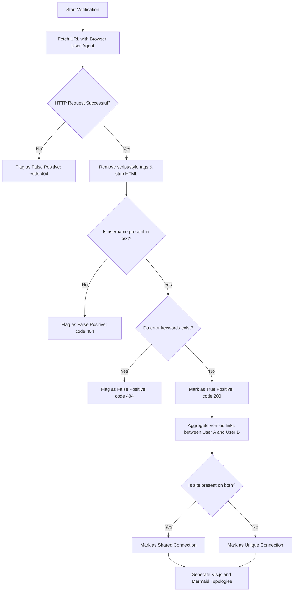

# 📋 OSINT Profile Verification & Correlation Logic Walkthrough

This document provides a comprehensive technical overview of the logic used to verify active OSINT profiles and correlate digital footprints between multiple targets.

---

## 🎯 Brief Description
The OSINT verification and correlation module is designed to eliminate false-positive accounts (instances where a scanned site returns a `200 OK` code but does not host the target profile). It validates URLs in parallel by looking for the target's handle in the page body and scanning for invalid-profile signatures, then aligns the verified footprints of multiple targets to extract shared connections and draw an interactive network map.

---

## 💻 Code Implementation

The logic is split between two primary modules:
1. **Verification Module**: [verify.py](file:///C:/Users/joker/OneDrive/Documents/Github/cybersamurai_business/blackdragon/dev/osint_report_function/verify.py#L29-L65) - Performs body analysis and signature detection.
2. **Correlation Module**: [report.py](file:///C:/Users/joker/OneDrive/Documents/Github/cybersamurai_business/blackdragon/dev/osint_report_function/report.py#L125-L162) - Aligns footprints and builds the output dashboard.

### verify.py Profile Check
```python
def check_url_for_profile(url, username):
    req = urllib.request.Request(
        url, 
        headers={'User-Agent': USER_AGENT}
    )
    try:
        with urllib.request.urlopen(req, timeout=8) as response:
            html = response.read().decode('utf-8', errors='ignore')
            
            # 1. Clean HTML to avoid picking up script tags / styles
            text_content = re.sub(r'<script.*?>.*?</script>', '', html, flags=re.DOTALL | re.IGNORECASE)
            text_content = re.sub(r'<style.*?>.*?</style>', '', text_content, flags=re.DOTALL | re.IGNORECASE)
            text_content = re.sub(r'<.*?>', ' ', text_content)  # strip tags
            
            # 2. Check if username is present in the text (case-insensitive)
            username_present = username.lower() in text_content.lower()
            if not username_present:
                return False, f"Username '{username}' not found in page body."
                
            # 3. Check for typical error signatures (case-insensitive)
            for pattern in ERROR_PATTERNS:
                if re.search(pattern, text_content, re.IGNORECASE):
                    return False, f"Error keyword matched: '{pattern}'"
                    
            return True, "Profile verified."
    except Exception as e:
        return False, str(e)
```

---

## 🔄 Logical Breakdown & Branches

The validation workflow operates as a pipeline:



### 1. Error Patterns Scanned
The system searches the text content for the following signatures:
- `"user not found"`, `"profile not found"`, `"member not found"`, `"no such user"`
- `"does not exist"`, `"invalid user"`, `"cannot find the user"`, `"profile does not exist"`
- `"page not found"`, `"error 404"`, `"404 not found"`
- `"sign up to view"`, `"create an account to"`, `"register to see"`, `"join to see"`

---

## 📊 Variable Matrix

| Variable Name | Type | Scope | Description |
| --- | --- | --- | --- |
| `url` | `str` | Argument | The URL of the profile scanned on a target website. |
| `username` | `str` | Argument | The base username scanned (e.g. `luizcalixt0`). |
| `text_content` | `str` | Local | Cleaned page text body (scripts, styling, and HTML tags stripped). |
| `ERROR_PATTERNS` | `list` | Global | Common signatures indicating a non-existent profile. |
| `templates` | `dict` | Local | Key-value store of site names mapped to URL templates. |
| `shared_sites` | `set` | Local | Set containing sites common to both User A and User B footprints. |
| `user_unique_sites`| `dict` | Local | Stores unique sites (value `set`) mapped to each user (`str` key). |
| `embedded_sites` | `list` | Local | Formatted data object list injected into JavaScript. |

---

## ⚙️ System Integration

```
+------------------+      +--------------------+      +-------------------------+
|                  |      |                    |      |                         |
|  raw_reports/    | ---> |  verify.py         | ---> |  verified_reports/      |
|  (Raw CSV scans) |      |  (Filter false 200)|      |  (Cleaned CSV data)     |
|                  |      |                    |      |                         |
+------------------+      +--------------------+      +-------------------------+
                                                                   |
                                                                   v
+------------------+      +--------------------+      +-------------------------+
|                  |      |                    |      |                         |
|  visualizer      | <--- |  report.py         | <--- |  global_report.css      |
|  (Interactive    |      |  (Link templates,  |      |  (Inlined styling)      |
|  HTML Dashboard) |      |   Vis.js, Mermaid) |      |                         |
+------------------+      +--------------------+      +-------------------------+
```

1. **Input Interface**: Scans are loaded as raw CSV files. The verification script `verify.py` acts as a firewall filter.
2. **Output Modification**: Verified reports write back updated status codes (`404` and `Not Found` for false positives), guaranteeing downstream modules only see true positive links.
3. **Template Registry**: During correlation, standard profiles contribute to a site-wide URL template dictionary, dynamically enabling URL reconstruction for other users.
4. **Visualizer Rendering**: The output HTML leverages this clean data to build the dynamic topology using Vis.js and Mermaid, complete with link routing.
