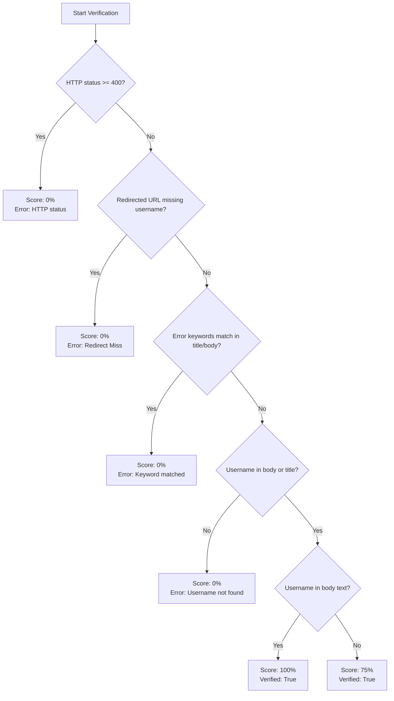

# 📋 OSINT Profile Verification & Confidence Scoring Logic Walkthrough

This document explains the technical details, algorithm rules, variables, and flows used by `sheylong.js` to verify target profiles and compute confidence scores.

---

## 📖 Brief Description
The profile verification engine fetches the rendered HTML and text body of target platform URLs, screens out false positives (e.g. login walls, deleted pages, or redirects returning HTTP 200 OK), checks for username presence, and computes a profile existence confidence score (0% to 100%).

---

## 💻 Code Implementation

The logic is defined inside the **[sheylong.js](blackdragon/dev/osint_report_function/sheylong.js)** script:
* **Function**: `verifyProfile` (helper method)
* **Configuration Loading**: `loadErrorPatterns` (loads false positive rules)

---

## 🔄 Logical Breakdown

The logic evaluates profile pages using the following decision tree:

### Verification & Scoring Conditions
1. **HTTP Status Code Check**: If status is `>= 400`, the page failed to load.
   * `verified` = `false`, `score` = `0%`.
2. **Redirect Validation**: If page redirected and the final URL does not contain the username (case-insensitive).
   * `verified` = `false`, `score` = `0%`.
3. **False Positive Screening**: Scans the page title and body text against patterns loaded from `false-positive-list.txt` (with dynamic `$user` substitution).
   * `verified` = `false`, `score` = `0%`.
4. **Scoring Logic**:
   * **Base Score (75%)**: Awarded if the page loaded successfully, passed screening, and the username is found in the page title or body text.
   * **Bonus Score (+25%)**: Awarded if the username is found in the body text (excluding matches found solely in the HTML title).

---

## 📊 Variable Matrix

| Variable | Type | Description / Role |
| :--- | :--- | :--- |
| `statusCode` | `number` | The HTTP status code returned by the page load (e.g. 200, 404). |
| `finalUrl` | `string` | The final redirected URL of the browser tab. |
| `pageTitle` | `string` | The extracted HTML page title text. |
| `textContent` | `string` | The rendered inner body text of the document. |
| `username` | `string` | The target username being scanned. |
| `verified` | `boolean` | Set to `true` if profile passed all validation gates. |
| `confidenceScore` | `number` | The computed confidence level (0, 75, or 100). |
| `matchedErrorPattern` | `string` | Stores the keyword/rule description if verification fails. |

---

## 🔌 System Integration

* **Data Entry**: The verification function receives page data directly from the Puppeteer worker engine inside `sheylong.js` after navigation finishes.
* **Data Exit**: The computed results are exported to `rawReports/$username.csv`. These records are subsequently ingested by `report.py` to filter out negative matches (Score = 0%) and render true positive nodes on the connection maps.
