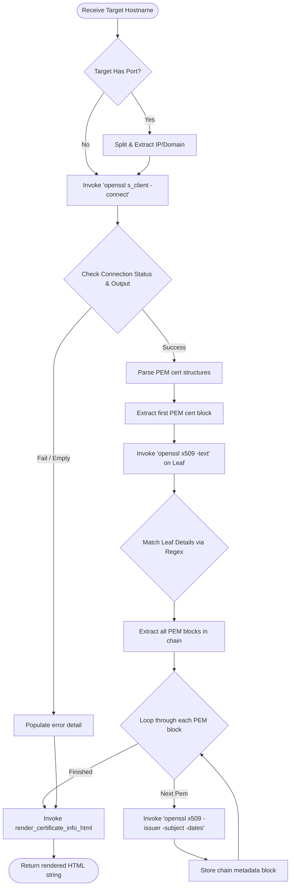

# 📋 Certificate Retrieval & Chain Validation Logic Walkthrough

This document explains the purpose, logical structure, variable roles, and integration details of the certificate details and chain validation logic implemented inside the Cyber Samurai TLS Report generator.

---

## 🔍 1. Brief Description & Purpose

The certificate retrieval module is implemented inside [generateTLSReport.py](file:///C:/Users/joker/OneDrive/Documents/Github/cybersamurai_business/blackdragon/tls/generateTLSReport.py). Its purpose is to query the target server using standard OpenSSL commands, extract the complete TLS certificate leaf attributes (which are omitted or incomplete in standard raw scans), parse the intermediate and root certificate chain, and render these details in a dedicated, high-fidelity user interface.

---

## 💻 2. Code Implementation

The module consists of two main functions inside [generateTLSReport.py](file:///C:/Users/joker/OneDrive/Documents/Github/cybersamurai_business/blackdragon/tls/generateTLSReport.py):

### A. Certificate and Chain Extraction
Located in [generateTLSReport.py:L355-519](file:///C:/Users/joker/OneDrive/Documents/Github/cybersamurai_business/blackdragon/tls/generateTLSReport.py#L355-L519):
```python
def fetch_certificate_info(target: str) -> Dict:
    """
    Connects to the target server via OpenSSL s_client to retrieve certificate details and chain info.
    """
    info = {
        'leaf_details': {},
        'chain': [],
        'error': None
    }
    
    if not target:
        info['error'] = "No target domain provided."
        return info
        
    if ':' in target:
        target = target.split(':')[0]
        
    try:
        # Run openssl s_client -connect target:443 -servername target -showcerts
        cmd_client = ['openssl', 's_client', '-connect', f'{target}:443', '-servername', target, '-showcerts']
        proc_client = subprocess.run(cmd_client, input=b'', capture_output=True, timeout=10)
        
        # If execution fails or no stdout, check if openssl command failed
        if proc_client.returncode != 0 and not proc_client.stdout:
            info['error'] = f"Failed to connect to {target} via openssl s_client."
            if proc_client.stderr:
                info['error'] += f" Error: {proc_client.stderr.decode('utf-8', errors='ignore')[:300]}"
            return info
            
        cert_data = proc_client.stdout
        if not cert_data:
            info['error'] = "No output from openssl s_client."
            return info
            
        # 1. Extract Leaf Certificate Details
        start_idx = cert_data.find(b'-----BEGIN CERTIFICATE-----')
        end_idx = cert_data.find(b'-----END CERTIFICATE-----')
        if start_idx != -1 and end_idx != -1:
            leaf_pem = cert_data[start_idx:end_idx + len(b'-----END CERTIFICATE-----')]
            
            # Run openssl x509 -noout -text
            cmd_x509 = ['openssl', 'x509', '-noout', '-text']
            proc_x509 = subprocess.run(cmd_x509, input=leaf_pem, capture_output=True, timeout=5)
            
            # Run openssl x509 -noout -fingerprint -sha1
            cmd_fp = ['openssl', 'x509', '-noout', '-fingerprint', '-sha1']
            proc_fp = subprocess.run(cmd_fp, input=leaf_pem, capture_output=True, timeout=5)
            
            if proc_x509.returncode == 0:
                x509_text = proc_x509.stdout.decode('utf-8', errors='ignore')
                fp_text = proc_fp.stdout.decode('utf-8', errors='ignore').strip() if proc_fp.returncode == 0 else ""
                
                # Parse x509 text
                subject_m = re.search(r'Subject:\s*(.*)', x509_text)
                issuer_m = re.search(r'Issuer:\s*(.*)', x509_text)
                
                # Serial number can be multiline or single line
                serial_m = re.search(r'Serial Number:\s*\n?\s*([0-9a-fA-F:]+|[0-9]+(?:\s+\(0x[0-9a-fA-F]+\))?)', x509_text)
                if not serial_m:
                    serial_m = re.search(r'Serial Number:\s*(.*)', x509_text)
                
                not_before_m = re.search(r'Not Before\s*:\s*(.*)', x509_text)
                not_after_m = re.search(r'Not After\s*:\s*(.*)', x509_text)
                
                pubkey_algo_m = re.search(r'Public Key Algorithm:\s*(.*)', x509_text)
                pubkey_size_m = re.search(r'Public-Key:\s*\((.*)\)', x509_text)
                
                # Subject Alternative Name
                san = 'None'
                san_match = re.search(r'Subject Alternative Name:\s*\n\s*(.*)', x509_text)
                if san_match:
                    san = san_match.group(1).strip()
                
                # Key Usage
                key_usage = 'None'
                ku_match = re.search(r'X509v3 Key Usage:\s*(?:critical)?\s*\n\s*(.*)', x509_text)
                if ku_match:
                    key_usage = ku_match.group(1).strip()
                
                # Extended Key Usage
                ext_key_usage = 'None'
                eku_match = re.search(r'X509v3 Extended Key Usage:\s*(?:critical)?\s*\n\s*(.*)', x509_text)
                if eku_match:
                    ext_key_usage = eku_match.group(1).strip()
                
                # NIST Curve
                nist_curve = 'N/A'
                curve_match = re.search(r'ASN1 OID:\s*(.*)', x509_text)
                if curve_match:
                    nist_curve = curve_match.group(1).strip()
                else:
                    curve_match2 = re.search(r'NIST Curve:\s*(.*)', x509_text)
                    if curve_match2:
                        nist_curve = curve_match2.group(1).strip()
                
                fingerprint = fp_text.split('=')[-1] if '=' in fp_text else fp_text
                
                info['leaf_details'] = {
                    'subject': subject_m.group(1).strip() if subject_m else 'Unknown',
                    'issuer': issuer_m.group(1).strip() if issuer_m else 'Unknown',
                    'serial': serial_m.group(1).strip() if serial_m else 'Unknown',
                    'not_before': not_before_m.group(1).strip() if not_before_m else 'Unknown',
                    'not_after': not_after_m.group(1).strip() if not_after_m else 'Unknown',
                    'fingerprint': fingerprint,
                    'pubkey_algo': pubkey_algo_m.group(1).strip() if pubkey_algo_m else 'Unknown',
                    'pubkey_size': pubkey_size_m.group(1).strip() if pubkey_size_m else 'Unknown',
                    'san': san,
                    'key_usage': key_usage,
                    'ext_key_usage': ext_key_usage,
                    'nist_curve': nist_curve
                }
            else:
                info['error'] = "Failed to parse leaf certificate text."
        else:
            info['error'] = "No PEM certificates found in output."
            
        # 2. Extract Chain details
        pems = []
        curr = 0
        while True:
            start = cert_data.find(b'-----BEGIN CERTIFICATE-----', curr)
            if start == -1:
                break
            end = cert_data.find(b'-----END CERTIFICATE-----', start)
            if end == -1:
                break
            pems.append(cert_data[start:end + len(b'-----END CERTIFICATE-----')])
            curr = end + len(b'-----END CERTIFICATE-----')
            
        for idx, pem in enumerate(pems):
            cmd_x509_chain = ['openssl', 'x509', '-noout', '-issuer', '-subject', '-dates']
            proc_x509_chain = subprocess.run(cmd_x509_chain, input=pem, capture_output=True, timeout=5)
            
            if proc_x509_chain.returncode == 0:
                chain_text = proc_x509_chain.stdout.decode('utf-8', errors='ignore')
                
                issuer = 'Unknown'
                subject = 'Unknown'
                not_before = 'Unknown'
                not_after = 'Unknown'
                
                for line in chain_text.split('\n'):
                    if line.startswith('issuer='):
                        issuer = line[len('issuer='):].strip()
                    elif line.startswith('subject='):
                        subject = line[len('subject='):].strip()
                    elif line.startswith('notBefore='):
                        not_before = line[len('notBefore='):].strip()
                    elif line.startswith('notAfter='):
                        not_after = line[len('notAfter='):].strip()
                        
                info['chain'].append({
                    'index': idx + 1,
                    'subject': subject,
                    'issuer': issuer,
                    'not_before': not_before,
                    'not_after': not_after
                })
                
    except Exception as e:
        info['error'] = f"Error running openssl commands: {str(e)}"
        
    return info


def render_certificate_info_html(cert_info: Dict) -> str:
    """
    Renders the Certificate Info tab HTML contents.
    """
    if cert_info.get('error'):
        return f'''
        <div class="glass-card card-red" style="margin-bottom: 24px;">
            <h2 class="card-title">⚠️ Certificate Retrieval Error</h2>
            <div class="summary-text" style="margin-top: 10px;">
                <p>Failed to retrieve certificate details for the target host.</p>
                <p style="color: var(--color-critical); font-family: monospace; margin-top: 10px;">{escape(cert_info['error'])}</p>
            </div>
        </div>'''
        
    leaf = cert_info.get('leaf_details', {})
    chain = cert_info.get('chain', [])
    
    if not leaf:
        return '''
        <div class="glass-card card-orange" style="margin-bottom: 24px;">
            <h2 class="card-title">⚠️ No Certificate Data</h2>
            <div class="summary-text" style="margin-top: 10px;">
                No certificate data was retrieved from the target host.
            </div>
        </div>'''

    # Build Leaf Table rows
    leaf_rows = f'''
        <tr><td>Subject</td><td>{escape(leaf.get('subject', 'Unknown'))}</td></tr>
        <tr><td>Issuer</td><td>{escape(leaf.get('issuer', 'Unknown'))}</td></tr>
        <tr><td>Serial Number</td><td>{escape(leaf.get('serial', 'Unknown'))}</td></tr>
        <tr><td>SHA1 Fingerprint</td><td>{escape(leaf.get('fingerprint', 'Unknown'))}</td></tr>
        <tr><td>Validity (Not Before)</td><td>{escape(leaf.get('not_before', 'Unknown'))}</td></tr>
        <tr><td>Validity (Not After)</td><td>{escape(leaf.get('not_after', 'Unknown'))}</td></tr>
        <tr><td>Public Key Algorithm</td><td>{escape(leaf.get('pubkey_algo', 'Unknown'))}</td></tr>
        <tr><td>Public Key Size/Info</td><td>{escape(leaf.get('pubkey_size', 'Unknown'))}</td></tr>
    '''
    if leaf.get('nist_curve') and leaf['nist_curve'] != 'N/A':
        leaf_rows += f"<tr><td>NIST Curve</td><td>{escape(leaf['nist_curve'])}</td></tr>"
        
    leaf_rows += f'''
        <tr><td>Subject Alternative Name</td><td>{escape(leaf.get('san', 'None'))}</td></tr>
        <tr><td>X509v3 Key Usage</td><td>{escape(leaf.get('key_usage', 'None'))}</td></tr>
        <tr><td>X509v3 Extended Key Usage</td><td>{escape(leaf.get('ext_key_usage', 'None'))}</td></tr>
    '''

    # Build Chain HTML
    chain_html = '<div class="chain-list">'
    for idx, c in enumerate(chain):
        is_leaf = idx == 0
        is_last = idx == len(chain) - 1
        
        badge_class = "badge-info" if is_leaf else ("badge-green" if is_last else "badge-yellow")
        badge_text = "Certificate 1 (Leaf)" if is_leaf else (f"Certificate {c['index']} (Root)" if is_last else f"Certificate {c['index']} (Intermediate)")
        
        chain_html += f'''
        <div class="chain-item">
            <div style="display: flex; align-items: center; justify-content: space-between; margin-bottom: 10px;">
                <span class="badge {badge_class}" style="padding: 4px 10px; font-size: 11px; font-weight: 700; border-radius: 4px; text-transform: uppercase;">{badge_text}</span>
            </div>
            <table class="cert-table">
                <tr><td>Subject</td><td>{escape(c.get('subject', 'Unknown'))}</td></tr>
                <tr><td>Issuer</td><td>{escape(c.get('issuer', 'Unknown'))}</td></tr>
                <tr><td>Validity</td><td>
                    <span style="color: var(--text-muted);">Not Before:</span> {escape(c.get('not_before', 'Unknown'))}<br>
                    <span style="color: var(--text-muted);">Not After:</span> {escape(c.get('not_after', 'Unknown'))}
                </td></tr>
            </table>
        </div>'''
        
        if not is_last:
            chain_html += '''
            <div class="chain-arrow">
                <svg width="20" height="20" viewBox="0 0 24 24" fill="none" stroke="currentColor" stroke-width="2.5" stroke-linecap="round" stroke-linejoin="round" style="color: var(--accent-red);"><line x1="12" y1="5" x2="12" y2="19"></line><polyline points="19 12 12 19 5 12"></polyline></svg>
            </div>'''
            
    chain_html += '</div>'

    html = f'''
    <div class="config-grid">
        <!-- Certificate Details -->
        <div class="glass-card">
            <h2 class="card-title">📜 Certificate Leaf Details</h2>
            <table class="cert-table">
                {leaf_rows}
            </table>
        </div>
        
        <!-- Certificate Chain -->
        <div class="glass-card">
            <h2 class="card-title">🔗 Certificate Chain Details</h2>
            <div style="font-size: 13px; font-weight: 700; color: var(--text-secondary); text-transform: uppercase; letter-spacing: 0.5px; margin-top: 10px;">
                Total certificates in chain: {len(chain)}
            </div>
            {chain_html}
        </div>
    </div>'''
    
    return html
```

---

## 🧮 3. Logical Breakdown

The certificate logic handles asynchronous command execution, regex extraction, byte manipulation, and sequential chain evaluation.

### Logic Flow Diagram


---

## 📊 4. Variable Matrix

| Variable Name | Data Type | Purpose / Role |
| :--- | :--- | :--- |
| `target` | `str` | Hostname to evaluate (extracted from findings dictionary). |
| `info` | `dict` | Output structure storing leaf metadata, chain lists, and error context. |
| `cmd_client` | `list` | Command line parameters list used to run OpenSSL s_client client handshake. |
| `proc_client` | `CompletedProcess` | Holds standard output, standard error, and exit code returned from client process call. |
| `cert_data` | `bytes` | Raw console output returned by the command containing connection certificates. |
| `leaf_pem` | `bytes` | Extracted leaf certificate PEM bytes (from start to end boundaries). |
| `proc_x509` | `CompletedProcess` | Execution process structure for leaf details text parsing. |
| `x509_text` | `str` | UTF-8 decoded text representing the certificate details dump. |
| `pems` | `list` | Extracted array containing each certificate PEM block found in the console buffer. |
| `chain_text` | `str` | Text dump detailing metadata variables for a specific intermediate or root certificate. |
| `cert_info_html` | `str` | Complete rendered HTML tab segment to inject. |

---

## 🔄 5. System Integration

*   **Inputs**: The domain hostname extracted dynamically by `SamuraiReportParser` from the `testssl.sh` raw HTML file (`findings['target']`).
*   **Execution Trigger**: Triggered inside the `generate_html_report` function during document rendering.
*   **Outputs**: Renders an interactive layout injected into the `<!--CERTIFICATE_INFO_HTML-->` tag placeholder. It is exposed in a separate tab panel with tab switcher handling logic, resolving the system's previous lack of direct, structured certificate analysis details.
