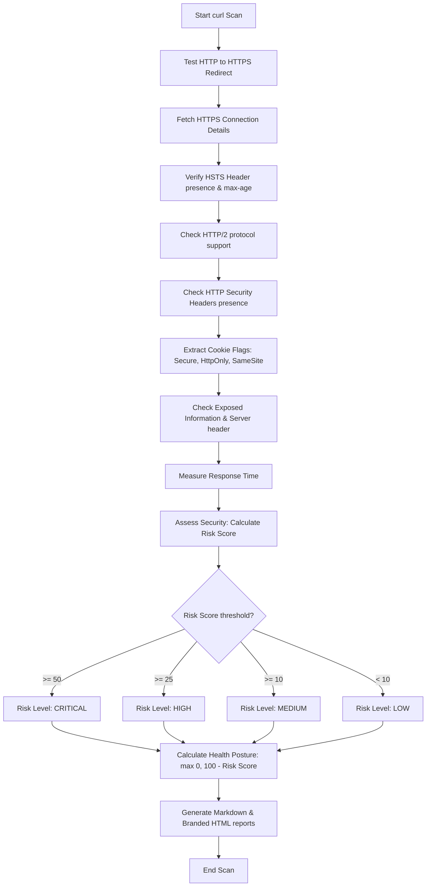

# 📋 Website Security Assessment & Header Analysis Walkthrough

This document outlines the design, testing criteria, scoring algorithms, and report generation workflows used in the Cyber Samurai Website Security Assessment tool (`curlReport.py`).

## 1. Description
The assessment tool performs automated lightweight security scans of target websites using the `curl` utility. It inspects transport protocol enforcement, active cipher/protocol versions, HTTP security headers, cookie attributes, server information disclosure, and response times to evaluate the target's security posture. The results are calculated into a risk score and rendered as both a Markdown document and a branded, responsive HTML dashboard matching the Cyber Samurai styling guidelines.

---

## 2. Code Implementation
The assessment logic, scoring rules, and HTML generation functions are implemented inside the script [curlReport.py](file:///C:/Users/joker/OneDrive/Documents/Github/cybersamurai_business/blackdragon/curl/curlReport.py).

### Core Logic References
- **Security Assessment & Scoring Rules**: [curlReport.py:L228-305](file:///C:/Users/joker/OneDrive/Documents/Github/cybersamurai_business/blackdragon/curl/curlReport.py#L228-L305) (inside `assess_security`)
- **Branded HTML Report Generation**: [curlReport.py:L436-967](file:///C:/Users/joker/OneDrive/Documents/Github/cybersamurai_business/blackdragon/curl/curlReport.py#L436-L967) (inside `generate_html`)
- **Markdown Report Generation**: [curlReport.py:L306-434](file:///C:/Users/joker/OneDrive/Documents/Github/cybersamurai_business/blackdragon/curl/curlReport.py#L306-L434) (inside `generate_markdown`)

---

## 3. Logical Breakdown & Scoring Formulas

### Workflow Flowchart

### Risk Scoring Formula
The raw risk score ($R$) starts at $0$ and accumulates penalty points based on missing headers, misconfigured settings, and exposures:

$$R = \sum P_{penalties}$$

The assessment logic applies the following penalty values ($P_{penalties}$):

| Security Check / Missing Control | Penalty ($P$) | Target Variable Check |
| :--- | :---: | :--- |
| **No HTTP to HTTPS Redirect** | `+40` | `redirect['redirects_to_https'] == False` |
| **HSTS Header Missing** | `+25` | `hsts['enabled'] == False` |
| **Content-Security-Policy (CSP) Missing** | `+15` | `headers['content_security_policy'] == False` |
| **X-Frame-Options (Clickjacking) Missing** | `+10` | `headers['x_frame_options'] == False` |
| **X-Content-Type-Options Missing** | `+5` | `headers['x_content_type_options'] == False` |
| **Cookie Missing Secure Flag** (Per Cookie) | `+15` | `cookie['secure'] == False` |
| **Cookie Missing HttpOnly Flag** (Per Cookie) | `+10` | `cookie['httponly'] == False` |
| **Server Header / Version Exposed** | `+5` | `exposed_info['server_version']` is present |
| **Directory Indexing / Listing Enabled** | `+20` | `exposed_info['directory_listing'] == True` |

### Posture Health Rating
The final Security Health percentage ($H$) is calculated as:

$$H = \max(0, 100 - R)$$

The security rating is evaluated as follows:
- **SECURE**: $H \ge 90\%$ (Green highlight: `#10b981`)
- **STRONG**: $75\% \le H < 90\%$ (Blue highlight: `#3b82f6`)
- **WARNING**: $50\% \le H < 75\%$ (Amber highlight: `#f59e0b`)
- **CRITICAL**: $H < 50\%$ (Red highlight: `#ff2e3b`)

---

## 4. Variable Matrix

| Variable Name | Data Type | Scope | Description / Purpose |
| :--- | :---: | :---: | :--- |
| `self.target` | `str` | Instance | Target domain/host string (e.g., `cybersamurai.co.uk`). |
| `self.results` | `dict` | Instance | Store all scan outcomes under subkeys (`redirect`, `hsts`, etc.). |
| `self.findings` | `list` | Instance | List of tuples `(severity, title, details)` for security issues. |
| `self.recommendations` | `list` | Instance | Suggested adjustments and mitigations. |
| `risk_score` | `int` | Method | Accumulated penalty points during assessment. |
| `self.risk_level` | `str` | Instance | Calculated severity level based on score (`CRITICAL`, `HIGH`, etc.). |
| `health_score` | `int` | Method | Calculated overall security rating posture percentage ($100 - R$). |

---

## 5. System Integration
- **Input Data**: The tool accepts the target domain as a command-line argument (`sys.argv[1]`). Subprocess executions of `curl` query the target host and return raw response headers.
- **Output Files**: Generates a raw markdown report file (`assessment_<target>_<timestamp>.md`) and a branded HTML dashboard file (`assessment_<target>_<timestamp>.html`).
- **CSS Styling Integration**: The script attempts to dynamically fetch style declarations from [global_report.css](file:///C:/Users/joker/OneDrive/Documents/Github/cybersamurai_business/blackdragon/reference/global_report.css). If the file is not found, the script relies on a complete built-in stylesheet fallback so that report layouts and circular charts display correctly in any environment.
