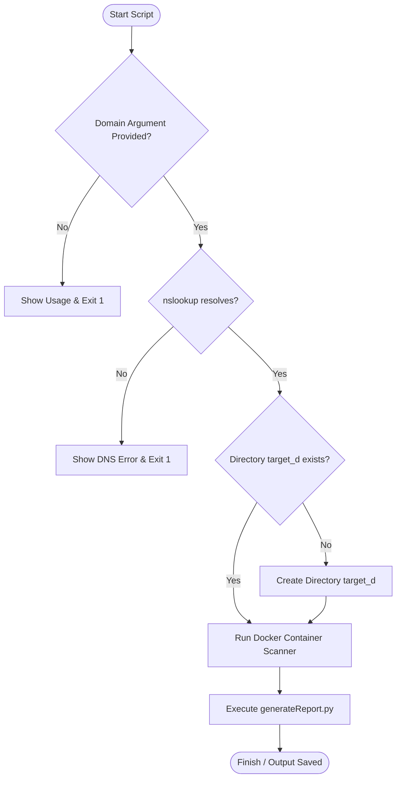

# 📋 TLS Assessment Execution Logic & Code Walkthrough

This document provides a technical walkthrough of the orchestrator execution script that runs TLS vulnerability scans and generates enhanced security reports.

---

## 🔍 1. Brief Description

The orchestration logic is implemented in the [runTLSReport.sh](file:///C:/Users/joker/OneDrive/Documents/Github/cybersamurai_business/blackdragon/runTLSReport.sh) shell script. 

This bash script automates the end-to-end execution of a domain-based TLS/SSL security assessment. It verifies DNS resolution, sets up a local output workspace, executes a vulnerability scan using a containerized instance of the core security scanner (complete with custom headers), and processes the scan results using an enhancement Python script to produce a styled, client-ready security audit report.

---

## 💻 2. Code Implementation

Below is the complete implementation of the orchestrator script:

```bash
#!/bin/bash

# Check if domain is provided
if [ -z "$1" ]; then
    echo "❌ Error: Domain is required"
    echo "Usage: $0 <target_domain>"
    echo "Example: $0 cybersamurai.co.uk"
    exit 1
fi

target="$1"

# DNS Pre-check - verify domain resolves
echo "🔍 Checking DNS resolution for: $target"
if ! nslookup "$target" > /dev/null 2>&1; then
    echo "❌ Error: Domain failed to resolve DNS record"
    echo "   Please check that '$target' is a valid domain and try again"
    exit 1
fi
echo "✅ DNS resolution successful"

# Create folder with target name + _d
folder="${target}_d"

# Check if folder exists, if not create it
if [ ! -d "$folder" ]; then
    mkdir -p "$folder"
    echo "📁 Created folder: $folder"
fi

# Define assessment image properties
img_host="ghcr.io"
img_repo="testssl"
img_name="testssl.sh"
scanner_img="${img_host}/${img_repo}/${img_name}"

echo "🔍 Starting TLS/SSL scan for: $target"

# Run scan and save reports in the folder
docker run --rm -it -v "$(pwd)/$folder:/out" \
  "$scanner_img" -E -g -U -oA /out/samuraiTLSReport \
  --hints \
  --reqheader "X-Custom-Header: Cyber Samurai Security Scan" \
  --reqheader "User-Agent: CyberSamurai-Security-Assessment" \
  "$target"

# Generate enhanced report in the same folder
python3 generateReport.py -o "$folder/enhancedTLSReport.html" "$folder/samuraiTLSReport.html"

echo "✅ TLS/SSL Report Generated in: $folder/"
echo "📄 Reports saved in: $(pwd)/$folder/"
```

---

## 🧮 3. Logical Breakdown

The script executes sequentially following these phases:

### ⚙️ Step-by-Step Execution Sequence
1. **Input Check**:
   Checks if the target domain argument (`$1`) is empty. If not provided, it outputs usage instructions and exits.
2. **DNS Validation (Pre-flight Check)**:
   Uses `nslookup` to verify if the domain resolves to an IP address. This guards against starting a long scan on a non-existent or misconfigured host.
3. **Workspace Initialization**:
   Constructs a target folder named `${target}_d` (e.g., `cybersamurai.co.uk_d`) to store all logs, raw reports, and HTML reports. It creates the folder if it does not already exist.
4. **Target Assessment (Containerized Scanner)**:
   Launches a transient (`--rm`), interactive (`-it`) Docker container using the dynamically constructed scanner image identifier.
   - Mounts the local workspace folder to `/out` inside the container.
   - Evaluates:
     - `-E`: Available ciphers per protocol.
     - `-g`: Cipher strength and order preference.
     - `-U`: Major CVE vulnerabilities (BEAST, LUCKY13, ROBOT, etc.).
   - Employs custom headers to ensure scans are identifiable (`X-Custom-Header` and `User-Agent`).
   - Saves all output formats (`-oA`) as `/out/samuraiTLSReport`.
5. **Post-Processing & HTML Enhancement**:
   Calls `python3 generateReport.py` to ingest the generated raw report (`samuraiTLSReport.html`) and build an elegant, security health-rated document (`enhancedTLSReport.html`).

### 📊 System Flowchart



---

## 📋 4. Variable Matrix

The variables used during the execution of the bash script are described below:

| Variable Name | Type | Description / Role |
| :--- | :--- | :--- |
| `$1` | `str` | First command-line positional parameter representing the target domain (e.g. `cybersamurai.co.uk`). |
| `target` | `str` | Sanitized local variable hold of the domain name to perform DNS checks and workspace setups on. |
| `folder` | `str` | Constructed folder name defined dynamically as `${target}_d`. |
| `img_host` | `str` | Host domain name of the registry repository. |
| `img_repo` | `str` | Repository segment of the scanner image. |
| `img_name` | `str` | Executable image name identifier. |
| `scanner_img` | `str` | Full concatenated string of the Docker scanner image. |

---

## 🔄 5. System Integration

### System Dependencies
- **Docker**: Must be installed and running on the host system to pull and run the scanner container.
- **Python 3**: Used to run `generateReport.py` for compiling raw results into custom HTML layouts.
- **nslookup**: Command utility used to verify target resolution.

### Data Flow Pipeline
```
[User Input Domain]
      │
      ▼
(runTLSReport.sh) ───[DNS Validation via nslookup]
      │
      ├─► [Create Workspace directory: <domain>_d/]
      │
      ├─► [Run Docker: Containerized Scanner] ───► Outputs raw report: samuraiTLSReport.html
      │                                                     │
      └─► [Execute generateReport.py] ◄─────────────────────┘
            │
            ▼
   Produces client-ready security audit report: enhancedTLSReport.html
```
