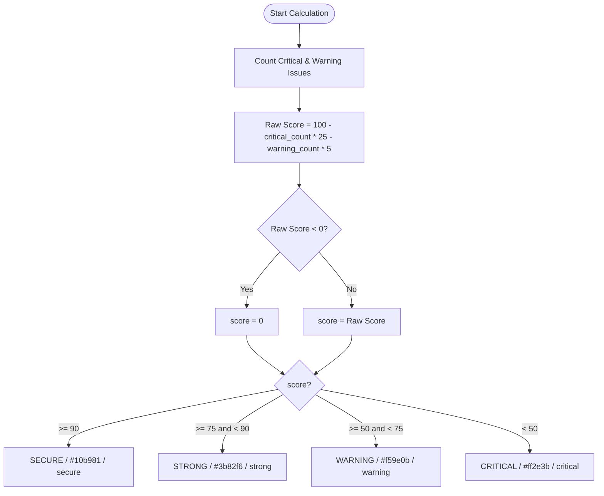

# 📋 TLS Security Health Score Logic & Code Walkthrough

This document provides a detailed walkthrough of the security health score calculation rules implemented in the TLS assessment report generator.

---

## 🔍 1. Brief Description

The health scoring logic is located in the [generate_html_report](file:///C:/Users/joker/OneDrive/Documents/Github/cybersamurai_business/blackdragon/ssl_report_function/generateTLSReport.py#L621) function of the [generateTLSReport.py](file:///C:/Users/joker/OneDrive/Documents/Github/cybersamurai_business/blackdragon/ssl_report_function/generateTLSReport.py) script.

This function evaluates parsed TLS scan findings (including vulnerabilities, supported/vulnerable protocols, and cipher suites), computes an overall percentage score (the **Health Score**), maps it to a qualitative rating, assigns styling/theme configurations, and constructs a responsive, premium HTML report containing interactive elements and dynamic SVG progress rings.

---

## 💻 2. Code Implementation

Below is the code section from [generateTLSReport.py:L848-884](file:///C:/Users/joker/OneDrive/Documents/Github/cybersamurai_business/blackdragon/ssl_report_function/generateTLSReport.py#L848-L884) that handles the categorization of vulnerabilities, calculation of the score, and mapping of the rating metadata:

```python
    # Count issues by severity
    critical_vulns = {k: v for k, v in findings['vulnerabilities'].items() if v['severity'] == 'CRITICAL'}
    warning_vulns = {k: v for k, v in findings['vulnerabilities'].items() if v['severity'] == 'WARNING'}
    pass_vulns = {k: v for k, v in findings['vulnerabilities'].items() if v['severity'] == 'PASS'}

    critical_count = len(critical_vulns)
    warning_count = len(warning_vulns)
    pass_count = len(pass_vulns)
    total_protocols = len(findings['protocols']['supported'])

    # Deprecated protocols
    deprecated_protos = [p for p in findings['protocols']['vulnerable'] if p in ['TLSv1', 'TLSv1.1']]

    # Updated health score logic:
    # - Start at 100%
    # - Deduct 25% for every critical issue
    # - Deduct 5% for every warning issue
    # - Capped at a minimum of 0%
    score = 100 - (critical_count * 25) - (warning_count * 5)
    score = max(0, score)

    if score >= 90:
        score_rating = "SECURE"
        score_color = "#10b981"  # Cyber Green
        score_class = "secure"
    elif score >= 75:
        score_rating = "STRONG"
        score_color = "#3b82f6"  # Cyber Blue
        score_class = "strong"
    elif score >= 50:
        score_rating = "WARNING"
        score_color = "#f59e0b"  # Cyber Yellow/Orange
        score_class = "warning"
    else:
        score_rating = "CRITICAL"
        score_color = "#ff2e3b"  # Cyber Red
        score_class = "critical"
```

---

## 🧮 3. Logical Breakdown

The scoring metric applies linear deductions based on vulnerability severity:

### ⚠️ Severity Assessment Rules
1. **Starting Score**:
   - The health score starts at a perfect baseline of **100%**.
2. **Critical Vulnerabilities Deduction**:
   - For every critical vulnerability identified, **25%** is deducted.
     $$\text{Deduction}_{\text{critical}} = \text{critical\_count} \times 25$$
3. **Warning Vulnerabilities Deduction**:
   - For every warning vulnerability identified, **5%** is deducted.
     $$\text{Deduction}_{\text{warning}} = \text{warning\_count} \times 5$$
4. **Calculated Score Formula**:
   - The final score is computed by subtracting both deductions, bounded by a lower limit of **0%**:
     $$\text{score} = \max(0, 100 - (\text{critical\_count} \times 25) - (\text{warning\_count} \times 5))$$

### 📊 Calculation & Rating Flowchart



---

## 📋 4. Variable Matrix

The following table details the primary variables used during score assessment and formatting:

| Variable Name | Type | Description / Role |
| :--- | :--- | :--- |
| `findings` | `Dict` | Input dictionary parsed from raw scan data, containing vulnerabilities, protocols, and cipher suites. |
| `critical_vulns` | `Dict` | A subset of `findings` mapping only vulnerability entries whose severity level is `'CRITICAL'`. |
| `warning_vulns` | `Dict` | A subset of `findings` mapping only vulnerability entries whose severity level is `'WARNING'`. |
| `pass_vulns` | `Dict` | A subset of `findings` mapping only vulnerability entries whose severity level is `'PASS'`. |
| `critical_count` | `int` | The calculated count of critical vulnerabilities. |
| `warning_count` | `int` | The calculated count of warning vulnerabilities. |
| `pass_count` | `int` | The calculated count of passed checks. |
| `total_protocols` | `int` | Total number of protocols detected in the assessment. |
| `deprecated_protos`| `List[str]` | List of deprecated protocols (`TLSv1` or `TLSv1.1`) present in the vulnerable list. |
| `score` | `int` | Calculated security health rating (percentage, $0\%$ to $100\%$). |
| `score_rating` | `str` | Qualitative status descriptor (`SECURE`, `STRONG`, `WARNING`, `CRITICAL`). |
| `score_color` | `str` | Hex color code applied to UI elements based on severity. |
| `score_class` | `str` | CSS class name injected into the HTML template to apply custom visual properties. |
| `score_offset` | `int` | Stroke dashoffset used to dynamically update the circular SVG progress meter ($427$ circumference). |

---

## 🔄 5. System Integration

### Data Input & Flow
1. The raw input file path is supplied to the assessment tool, which parses configuration details into the standard Python dictionary format (`findings`).
2. `generate_html_report()` parses the dictionary structure to extract severity metrics.

### HTML Template Placeholders
Once the scoring is resolved, the variables are formatted and injected into the target report templates. Specifically:
- **`<!--SCORE-->`**: Replaced with the calculated `score` value (e.g., `"25"`).
- **`<!--SCORE_RATING-->`**: Replaced with the textual descriptor (`score_rating`).
- **`<!--SCORE_COLOR-->`**: Replaced with the branding HEX code (`score_color`).
- **`<!--SCORE_CLASS-->`**: Replaced with the HTML styling class identifier (`score_class`).
- **`<!--SCORE_OFFSET-->`**: Replaced with `score_offset` to scale the circumference dash length of the animated progress circular gauge:
  ```python
  score_offset = 427 - (427 * score // 100)
  ```
- **Vulnerability/Status Counts**: `<!--CRITICAL_COUNT-->`, `<!--WARNING_COUNT-->`, `<!--PASS_COUNT-->`, and `<!--TOTAL_PROTOCOLS-->` are dynamically populated to display summary statistics at the top of the report.
