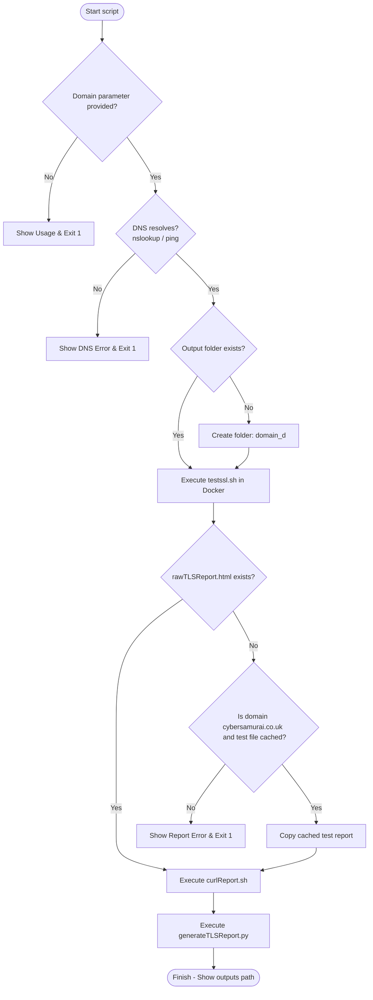

# 🛡️ runTLSReport.sh - TLS/SSL and HTTP Security Scan Orchestrator

The [runTLSReport.sh](file:///C:/Users/joker/OneDrive/Documents/Github/cybersamurai_business/blackdragon/ssl_report_function/runTLSReport.sh) script is the central orchestration wrapper for running comprehensive SSL/TLS security audits and HTTP header assessments against a target domain. It verifies DNS records, initiates a containerized Docker-based security scan, executes HTTP header diagnostics, and compiles the final results into a client-ready HTML report dashboard.

---

## 🔍 Overview

The orchestrator script automates a sequence of security assessment tasks:
1. **DNS Pre-flight Verification**: Ensures the target domain exists and is reachable before starting resource-intensive scans.
2. **Containerized TLS Scanning**: Runs the industry-standard `testssl.sh` tool in a transient Docker container to find protocol weaknesses, cipher suites, and CVE vulnerabilities.
3. **HTTP Posture Assessment**: Calls [curlReport.sh](file:///C:/Users/joker/OneDrive/Documents/Github/cybersamurai_business/blackdragon/ssl_report_function/curlReport.sh) to check security headers, redirection logic, cookie flags, and server banner leaks.
4. **Enhanced Report Compilation**: Calls [generateTLSReport.py](file:///C:/Users/joker/OneDrive/Documents/Github/cybersamurai_business/blackdragon/ssl_report_function/generateTLSReport.py) to parse the raw outputs, grade the security posture, and produce a unified, premium HTML report.

---

## 🚀 How to Use

### Prerequisites

Ensure the following tools are installed and available on your system path:
* **Docker**: Must be installed and running (used to execute `testssl.sh`).
* **Python 3**: Used for generating and styling the enhanced HTML report.
* **Bash Shell**: Native on Linux/macOS; compatible with WSL, Git Bash, or MSYS2 on Windows.
* **DNS Utilities**: Either `nslookup` or `ping` (used for the pre-flight check).

### Execution Syntax

Run the script by passing the target domain as the first positional argument:

```bash
./runTLSReport.sh <target_domain>
```

> [!NOTE]
> Make sure the script has execute permissions before running:
> `chmod +x runTLSReport.sh`

---

## 💡 Examples

### Executing a Live Scan

To run a scan against `cybersamurai.co.uk`:

```bash
./runTLSReport.sh cybersamurai.co.uk
```

### Expected Directory Outputs
The script creates an output folder named `<target_domain>_d` (e.g., `cybersamurai.co.uk_d`) in the current working directory. The directory contains:

| Filename | Format | Description |
| :--- | :--- | :--- |
| `rawTLSReport.html` | HTML | The raw output of the `testssl.sh` Docker scan. |
| `rawTLSReport.json` | JSON | Machine-readable results from `testssl.sh`. |
| `curlReport.json` | JSON | Machine-readable results from the HTTP headers audit. |
| `curlReport.html` | HTML | The separate HTTP security headers visual report. |
| `curlReport.md` | Markdown | Summary of the HTTP security headers checks. |
| `enhancedTLSReport.html` | HTML | **The final consolidated report** combining TLS audits and HTTP assessments with color-coded grading. |

---

## ⚙️ Execution Workflow

The script executes sequentially following these phases:



1. **Input Verification**: Verifies that a target domain has been supplied.
2. **DNS Pre-Check**: Checks if the domain resolves using `nslookup` (primary) or `ping` (fallback). If both fail or are missing, it logs a warning.
3. **Workspace Initialization**: Creates a directory called `${target}_d` if it doesn't already exist.
4. **TLS Scanning**: Spins up a Docker container with custom HTTP headers and runs the `testssl.sh` suite.
5. **Robust Fallback**: If the Docker scan fails or is skipped, and the target is `cybersamurai.co.uk`, the script copies a pre-cached raw report from the `test_units` directory to let local tests continue uninterrupted.
6. **HTTP Auditing**: Invokes the [curlReport.sh](file:///C:/Users/joker/OneDrive/Documents/Github/cybersamurai_business/blackdragon/ssl_report_function/curlReport.sh) script to review headers and cookies.
7. **Consolidation**: Runs the Python compiler to build the `enhancedTLSReport.html` dashboard containing TLS details, vulnerabilities, and HTTP headers grading.

---

## 🛠️ Commands Used Inside the Script

Here is a breakdown of the standard Linux commands used:

* **`nslookup`**: Performs a DNS lookup to check if the target domain has valid DNS records.
* **`ping`**: Serves as a fallback DNS verification command if `nslookup` is not installed.
* **`mkdir`**: Creates the target output folder.
* **`docker`**: Pulls and runs the transient `testssl.sh` container image.
* **`cp`**: Copies the mock/cached reports in fallback mode.
* **`chmod`**: Adds execute permissions to `curlReport.sh` before invoking it.
* **`python3`**: Executes Python scripts (`generateTLSReport.py`).
* **`cd`, `dirname`, `pwd`**: Dynamically determines the absolute path of the script directory to prevent relative execution errors.

---

## 🚩 Command Flags Breakdown

### 1. `ping`
* **`-c 1`**: Sends exactly 1 echo request packet.
* **`-W 2`**: Specifies a timeout of 2 seconds to wait for a response.

### 2. `mkdir`
* **`-p`**: Creates parent directories if necessary; suppresses error messages if the directory already exists.

### 3. `docker run`
* **`--rm`**: Automatically cleans up and removes the container file system when the container exits.
* **`-it`**: Runs the container in interactive mode and allocates a pseudo-TTY.
* **`-v "$(pwd)/$folder:/out"`**: Mounts the local output directory into `/out` inside the container, allowing `testssl.sh` to write reports directly back to the host system.

### 4. `testssl.sh` (Inside Docker Container)
* **`-E` / `--each-cipher`**: Tests all default ciphers to evaluate target compatibility.
* **`-g` / `--grease`**: Checks for cipher order preference and grease support.
* **`-U` / `--vulnerable`**: Tests for multiple well-known vulnerabilities (e.g. Heartbleed, CCS Injection, Ticketbleed, ROBOT, CRIME, BEAST, Lucky13, etc.).
* **`-oA /out/rawTLSReport`**: Instructs the tool to output reports in all available file formats (HTML, JSON, CSV, TXT) under the base name `/out/rawTLSReport`.
* **`--hints`**: Displays additional guidance or hints for failed/warned security test cases.
* **`--reqheader`**: Appends custom HTTP request headers to avoid blocking or identify scanning sources:
  * `X-Custom-Header: Cyber Samurai Security Scan`
  * `User-Agent: CyberSamurai-Security-Assessment`

### 5. `generateTLSReport.py`
* **`-o`**: Specifies the absolute or relative output path for the enhanced HTML report.
