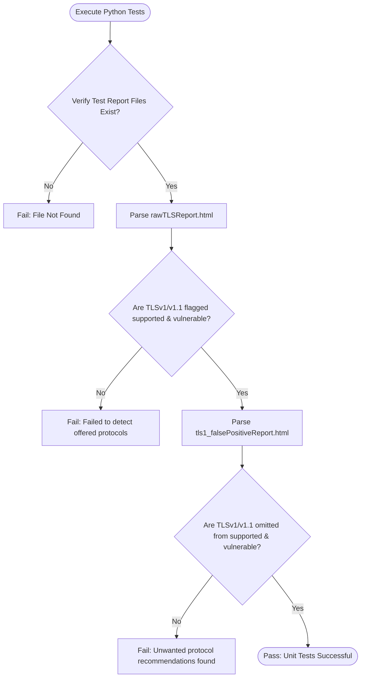

# 📋 TLS Parser Test Suite Walkthrough

This document explains the purpose, implementation, methodology, and passing criteria for the unit tests written to validate the TLS scan report parser.

---

## 🔍 1. Brief Description & Purpose

The test suite is implemented in [test_tls.py](file:///C:/Users/joker/OneDrive/Documents/Github/cybersamurai_business/blackdragon/ssl_report_function/test_units/test_tls.py).

Its primary purpose is to guard the TLS parser logic against regression anomalies, specifically ensuring that deprecated protocols (`TLSv1` and `TLSv1.1`) are only flagged as supported and vulnerable when they are actually offered by the target server. If they are disabled/unsupported on the server, the parser must ignore them, preventing them from incorrectly appearing in the client-facing Action Roadmap.

---

## 💻 2. Code Implementation

Below is the complete implementation of the unit test suite located in [test_tls.py:L1-56](file:///C:/Users/joker/OneDrive/Documents/Github/cybersamurai_business/blackdragon/ssl_report_function/test_units/test_tls.py#L1-L56):

```python
import os
import sys
import unittest

# Add parent directory to python path to resolve module imports
sys.path.insert(0, os.path.abspath(os.path.join(os.path.dirname(__file__), '..')))
from generateTLSReport import SamuraiReportParser

class TestTLSReportParser(unittest.TestCase):
    def setUp(self):
        # Locate report templates in the same folder as this test script
        self.script_dir = os.path.dirname(os.path.abspath(__file__))
        self.samurai_report_path = os.path.abspath(os.path.join(self.script_dir, 'rawTLSReport.html'))
        self.nec_report_path = os.path.abspath(os.path.join(self.script_dir, 'tls1_falsePositiveReport.html'))

    def test_samurai_report_parsing(self):
        """Test that TLSv1 and TLSv1.1 are correctly parsed as supported and vulnerable when offered."""
        self.assertTrue(os.path.exists(self.samurai_report_path), f"File not found: {self.samurai_report_path}")
        with open(self.samurai_report_path, 'r', encoding='utf-8') as f:
            content = f.read()
        
        parser = SamuraiReportParser(content)
        findings = parser.get_summary()
        
        # In rawTLSReport.html, TLSv1 and TLSv1.1 are supported and vulnerable
        self.assertIn('TLSv1', findings['protocols']['supported'])
        self.assertIn('TLSv1.1', findings['protocols']['supported'])
        self.assertIn('TLSv1', findings['protocols']['vulnerable'])
        self.assertIn('TLSv1.1', findings['protocols']['vulnerable'])
        
        # TLSv1.2 and TLSv1.3 are also supported
        self.assertIn('TLSv1.2', findings['protocols']['supported'])
        self.assertIn('TLSv1.3', findings['protocols']['supported'])

    def test_nec_report_parsing(self):
        """Test that TLSv1 and TLSv1.1 are NOT parsed as supported or vulnerable when they are disabled (not offered)."""
        self.assertTrue(os.path.exists(self.nec_report_path), f"File not found: {self.nec_report_path}")
        with open(self.nec_report_path, 'r', encoding='utf-8') as f:
            content = f.read()
        
        parser = SamuraiReportParser(content)
        findings = parser.get_summary()
        
        # In tls1_falsePositiveReport.html, TLSv1 and TLSv1.1 are disabled and must not be marked as supported or vulnerable
        self.assertNotIn('TLSv1', findings['protocols']['supported'])
        self.assertNotIn('TLSv1.1', findings['protocols']['supported'])
        self.assertNotIn('TLSv1', findings['protocols']['vulnerable'])
        self.assertNotIn('TLSv1.1', findings['protocols']['vulnerable'])
        
        # TLSv1.2 and TLSv1.3 are supported
        self.assertIn('TLSv1.2', findings['protocols']['supported'])
        self.assertIn('TLSv1.3', findings['protocols']['supported'])

if __name__ == '__main__':
    unittest.main()
```

---

## 🧮 3. Test Methodology & Logical Breakdown

The test suite validates the parser under two contrasting scenarios:

### 📥 Test Case 1: Offered Protocols (`test_samurai_report_parsing`)
- **Input Context**: Ingests [rawTLSReport.html](file:///C:/Users/joker/OneDrive/Documents/Github/cybersamurai_business/blackdragon/ssl_report_function/test_units/rawTLSReport.html) which contains active cipher suites under the `TLSv1` and `TLSv1.1` protocol blocks.
- **Expectation**: The parser must recognize that these protocols are actively supported/offered by the server and flag them as supported and vulnerable.

### 📥 Test Case 2: Disabled Protocols (`test_nec_report_parsing`)
- **Input Context**: Ingests [tls1_falsePositiveReport.html](file:///C:/Users/joker/OneDrive/Documents/Github/cybersamurai_business/blackdragon/ssl_report_function/test_units/tls1_falsePositiveReport.html) which shows a hyphen (`-`) under the `TLSv1` and `TLSv1.1` protocol blocks.
- **Expectation**: The parser must recognize that these protocols are not offered/disabled by the server and omit them from the supported and vulnerable findings lists.

### 📊 Verification Flowchart



---

## 📋 4. Passing Criteria

A test run is considered successful and marked as **passed** if and only if the following assertions are satisfied:

1. **Existence Bounding**:
   - The files [rawTLSReport.html](file:///C:/Users/joker/OneDrive/Documents/Github/cybersamurai_business/blackdragon/ssl_report_function/test_units/rawTLSReport.html) and [tls1_falsePositiveReport.html](file:///C:/Users/joker/OneDrive/Documents/Github/cybersamurai_business/blackdragon/ssl_report_function/test_units/tls1_falsePositiveReport.html) must be present in the `test_units/` directory.
2. **Supported Protocols Validation**:
   - `TLSv1` and `TLSv1.1` must exist in both `findings['protocols']['supported']` and `findings['protocols']['vulnerable']` for the `raw` report.
   - `TLSv1.2` and `TLSv1.3` must always exist in `findings['protocols']['supported']` for both reports.
3. **Disabled Protocols Validation**:
   - `TLSv1` and `TLSv1.1` must **not** exist in `findings['protocols']['supported']` or `findings['protocols']['vulnerable']` for the `false positive` report.

---

## 🔄 5. Execution Integration

The tests utilize the native Python `unittest` framework and can be run manually or integrated into CI/CD pipelines.

### Manual Execution
Run the following command from the workspace root:
```bash
python ssl_report_function/test_units/test_tls.py
```

### Successful Output Signature
```text
..
----------------------------------------------------------------------
Ran 2 tests in 0.012s

OK
```
